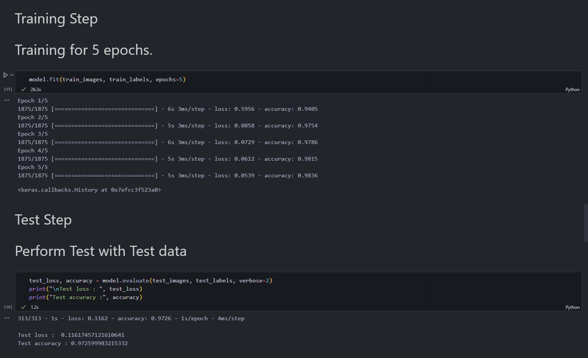
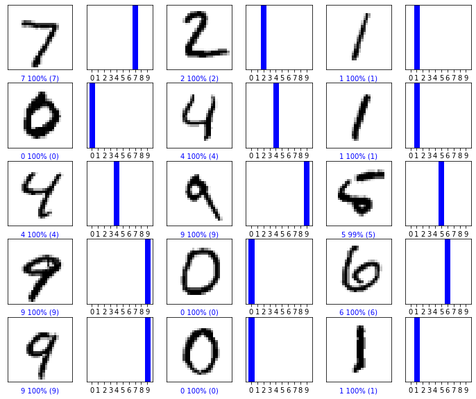
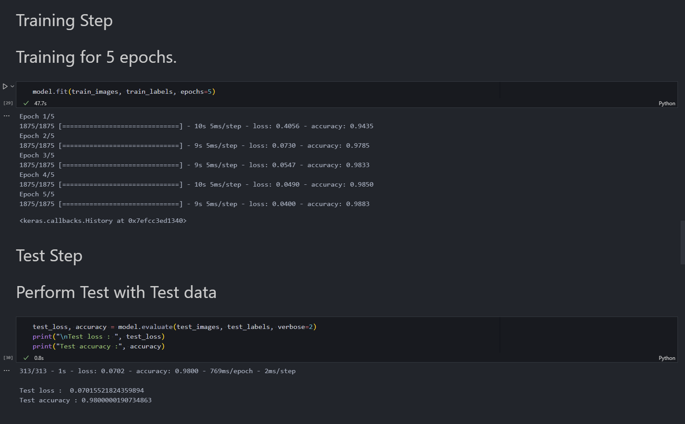
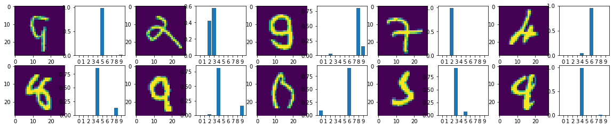
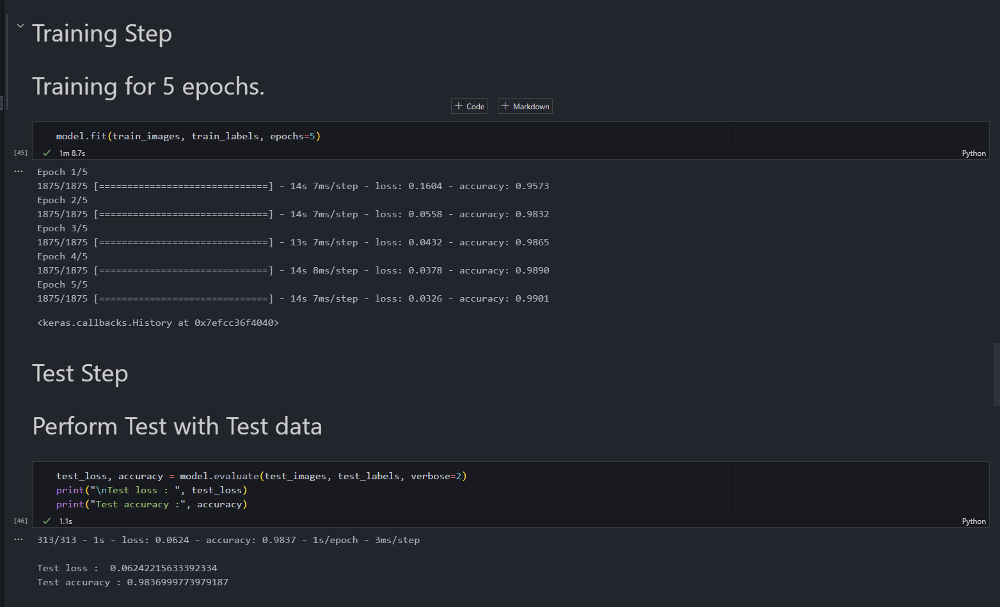
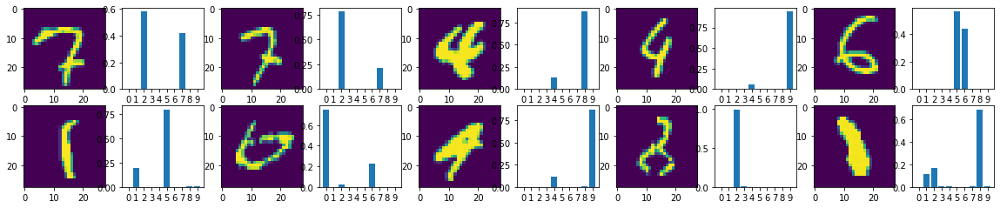

# Assignement 5

## Model 1
```python
model = keras.models.Sequential(
            [
                keras.layers.Conv2D(32, (3, 3), activation="relu", input_shape=(28, 28, 1)),  # layer 1
                keras.layers.MaxPool2D((2, 2)),  # layer 2
                keras.layers.Flatten(),
                keras.layers.Dense(10, activation="softmax"),
            ]
        )
```

#### Training with Training loss & Test Accuracy


#### Images and corresponding probability that predicted Right


#### Images and corresponding probability that predicted Wrong


<br>

## Model 2
```python
model = keras.models.Sequential(
            [
                keras.layers.Conv2D(32, (3, 3), activation="relu", input_shape=(28, 28, 1)),  # layer 1
                keras.layers.MaxPool2D((2, 2)),  # layer 2
                keras.layers.Conv2D(64, (3, 3), activation="relu"),  # layer 3
                keras.layers.MaxPool2D((2, 2)),  # layer 4
                keras.layers.Flatten(),
                keras.layers.Dense(10, activation="softmax"),
            ]
        )
```

#### Training with Training loss & Test Accuracy


#### Images and corresponding probability that predicted Right


#### Images and corresponding probability that predicted Wrong


<br>

## Model 3
```python
model = keras.models.Sequential(
            [
                keras.layers.Conv2D(32, (3, 3), activation="relu", input_shape=(28, 28, 1)),  # layer 1
                keras.layers.MaxPool2D((2, 2)),  # layer 2
                keras.layers.Conv2D(64, (3, 3), activation="relu"),  # layer 3
                keras.layers.Conv2D(64, (3, 3), activation="relu"),  # layer 4
                keras.layers.MaxPool2D((2, 2)),  # layer 5
                keras.layers.Conv2D(128, (3, 3), activation="relu"),  # layer 6
                keras.layers.Flatten(),
                keras.layers.Dense(10, activation="softmax"),
            ]
        )
```

#### Training with Training loss & Test Accuracy


#### Images and corresponding probability that predicted Right


#### Images and corresponding probability that predicted Wrong
